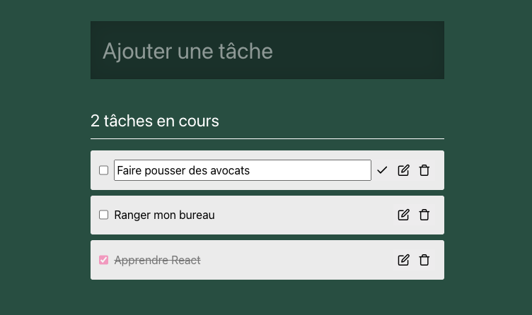

# CRUD Todolist en React

Dynamisons une interface en React pour gérer une liste de tâches 💪 (les composants sont dejà là mais ils sont statiques)

- Create : créer une nouvelle tache
- Read : voir la liste des taches
- Update : mettre à jour la valeur `done` d'une tache
- Delete : supprimer une tache

## Branchement API

L'api est dispo ici : https://github.com/O-clock-Muffin/Spe-React-E6-todolist-API
Il faut cloner le repo et installer les deps et lancer le serveur, l'API doit tourner sur le port 3000

### READ

- Stocke les taches dans le `state` de App : on va les chercher depuis l'API
- Calcule le compteur de tâches non-effectuées à partir des données du `state`.
- Dynamise tout l'affichage avec les données du `state` ou les données calculées depuis les données du `state`.

### CREATE

- Créé un composant contrôlé pour le input texte.
- A la soumission du formulaire, ajoute une nouvelle tâche dans le state et envoie une requete vers l'API pour créer aussi la tache coté back.

### UPDATE

- Créé un composant controlé pour les checkbox.
- Au changement de valeur d'une checkbox modifie le state et envoie une requete vers l'API pour modifier aussi la tache coté back.

### DELETE

- Au click sur le bouton `X` supprime la tache dans le state et envoie une requete delete vers l'API pour supprimer la tahce dans la base de données coté back.
